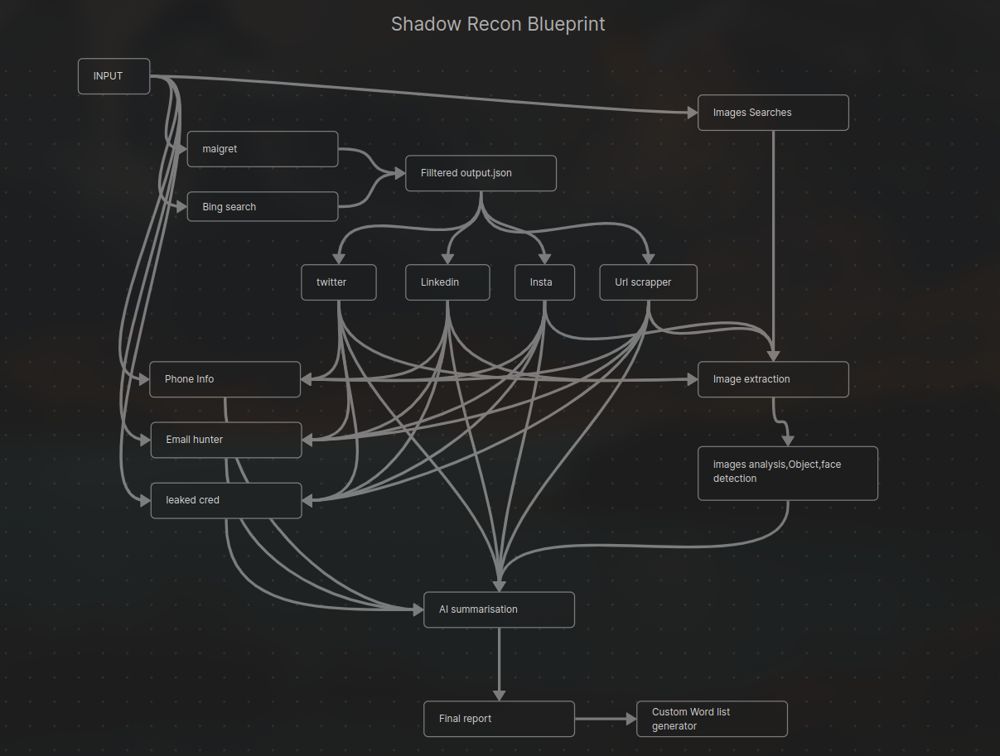

# ShadowRecon 🔍 (WIP - Development Paused)

ShadowRecon is an OSINT automation tool built to extract and correlate information from multiple online sources about a given target (name, username, email, etc.).

---

## 🧠 Blueprint

> Here's the high-level plan for ShadowRecon — this image guided initial development.

---

## ❗ Status: Development Paused

> After 4 intense days of grinding, this project has been **paused**. While major groundwork is in place, Instagram scraping issues and priority shifts led to a halt. However, the repo remains public for documentation and possible revival.

---

## ✅ Modules/Files Implemented

As of now, the project includes the following working components:

- `maigret_extraction.py` – Wrapper for Maigret to extract social profiles
- `bing_search.py` – Bing-based name-to-URL extraction script
- `filter.py` – Filters and ranks relevant URLs from search output
- `refined_targets.json` – Output JSON containing cleaned target info
- `main.py` – Main execution pipeline
- `input_handler.py` – CLI / prompt-based user input interface

---

## 🧱 What’s Done

- Basic input parsing (target name, username, email)
- Partial Instagram integration (profile scraping, now broken)
- Data filtering and deduplication
- Modular architecture for future plugin support
- Output JSON for downstream use

---

## 🧨 Known Issues

- ❌ Instagram scraping via Instaloader is unstable due to:
  - Rate limits (`403 Forbidden`)
  - Login issues / session expiry (`401 Unauthorized`)
- 📉 Unstructured "vibe coding" led to rapid burnout and messy debugging
- 📦 Still no modules for phone numbers, emails, image analysis, or summaries

---

## 📌 What’s Missing / What to Do Next

If continued, here are the recommended next phases:

### 🕵️ Data Extraction

- [ ] **Email scanning module** (emailhunter, haveibeenpwned, etc.)
- [ ] **Phone number OSINT** (NumVerify, Truecaller scraping, etc.)
- [ ] **Profile image analysis** (reverse search with face++ / Google Vision API)
- [ ] **AI-based text summarization** of scraped bios/posts

### 🛠️ Architecture

- [ ] Config file support for API keys / endpoints
- [ ] Refactor hardcoded paths
- [ ] Add CLI flags & options for optional modules

### 📊 Output & Reporting

- [ ] Auto-generate Markdown or PDF reports from JSON
- [ ] Embed image previews in output folder
- [ ] Possibly integrate NLP-based risk scoring

---

## 👨‍💻 Lessons Learned

- 🔥 Passion isn't enough without structure. Vibe coding ≠ progress.
- 🧱 Always start with a minimal MVP and grow from there.
- 🌐 Web scraping is fragile — use APIs or browser automation where possible.
- 🧭 Document *everything* — it becomes a map for later.

---

## 📂 Repo Purpose

This repo isn’t about perfection. It’s a **battle log** — proof of effort, grit, and growth.  
Even if unfinished, this is a valuable snapshot of learning in motion.

> “It’s better to build 70% of something real than dream 100% of something perfect.”

---

## 📝 Final Note

ShadowRecon may be paused, but it served its purpose: hands-on learning, architecture practice, and facing the frustrations of real-world scraping.

🛠️ Built with: Sweat, Debug Logs, and Copium  
📅 Status: Paused  
🚀 Resume Possibility: High, when time allows

